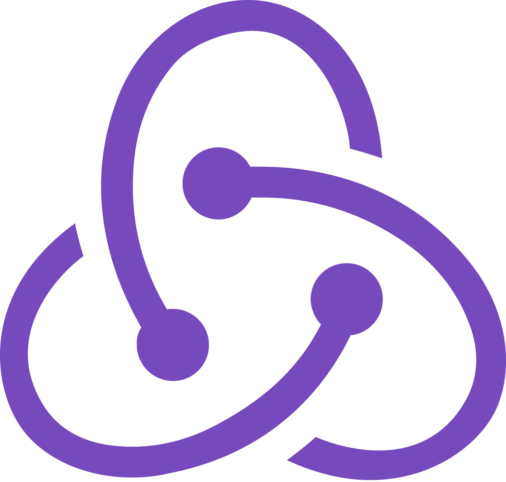

<h1 align="center">Hi 👋, I'm Sajal Shrestha</h1>
<h3 align="center">Software Developer and DevOps Engineer from Nepal</h3>

&nbsp;&nbsp;

&nbsp;&nbsp;

## 📜 About Me

- 💻 I love writing code and learn anythings about it.

- 📚 I teach programming and software development

- 💽 I use **Ubuntu** as my primary development environment and thinking about switching to **ArchLinux**

- 💬 Ask me about **Python, Django, React, Vue, BackBone, Testing, DevOps**

- 📧 How to reach me **sajal.shres@gmail.com**

## ✍ What I'm up to

- 💼 I'm currently working as **Senior Software Engineer** for **Cotiviti Corporations**

- 🔭 I’m currently working with **Django, FastAPI, VueJS and BackBoneJS**

- 🌱 I’m currently learning to implement different **design patterns**

- 👨‍💻 All of my projects are available at [https://github.com/sajalshres](https://github.com/sajalshres)

- 📝 I regulary write articles on [https://dev.to/sajalshres](https://dev.to/sajalshres)

## 🛠 Things I work with

## 📚 Things I am learning

## 📊 My GitHub Stats

&nbsp;

